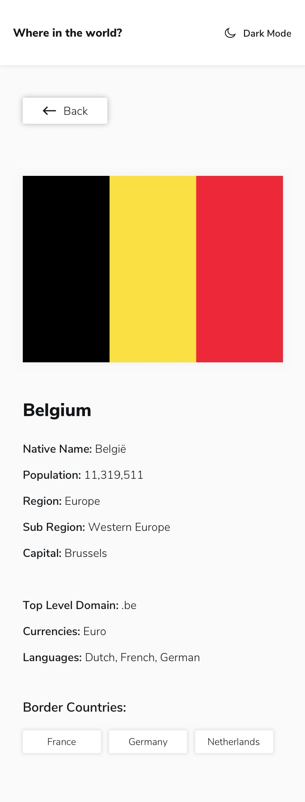

# REST Countries API with color theme switcher

Welcome!! :wave:

## Brief
The challenge is to integrate with the REST Countries API to pull country data and display it like in the designs.

It possible use any JavaScript framework/library on the front-end such as React or Vue. 

Your users should be able to:

* See all countries from the API on the homepage
* Search for a country using an input field
* Filter countries by region
* Click on a country to see more detailed information on a separate page
* Click through to the border countries on the detail page
* Toggle the color scheme between light and dark mode (optional)

## Demo Result

[Demo](https://cocky-swanson-e50106.netlify.app/)

## Desing

Thanks for view :green_heart:
